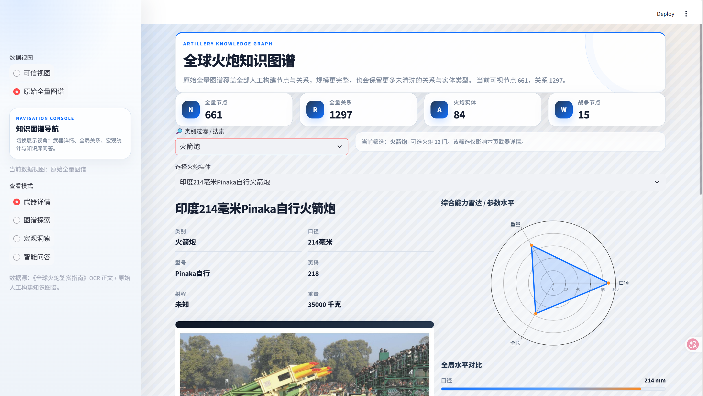
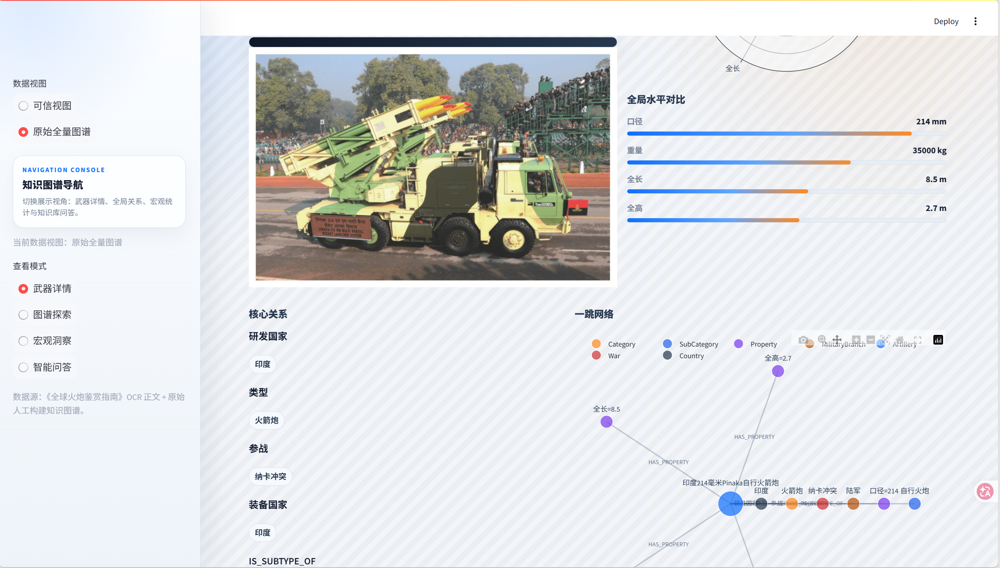
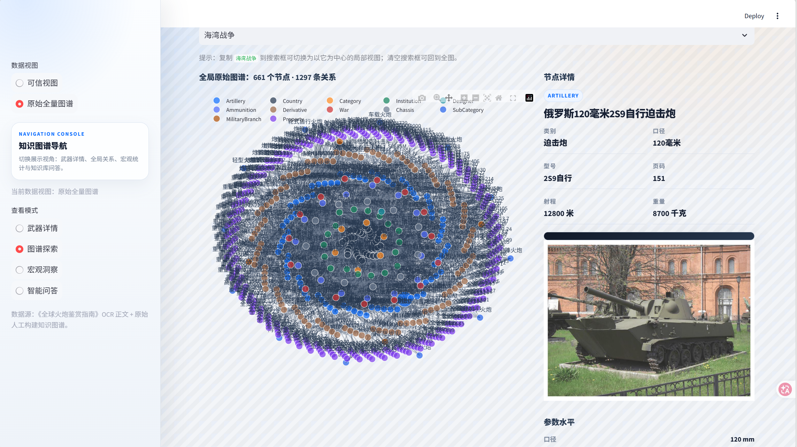
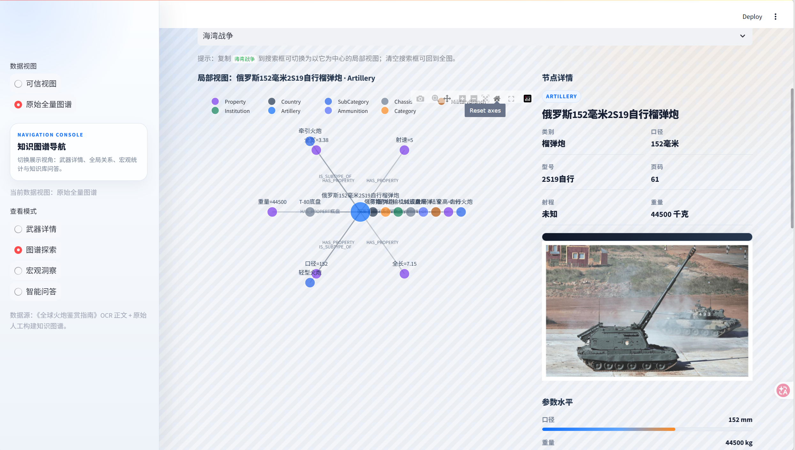
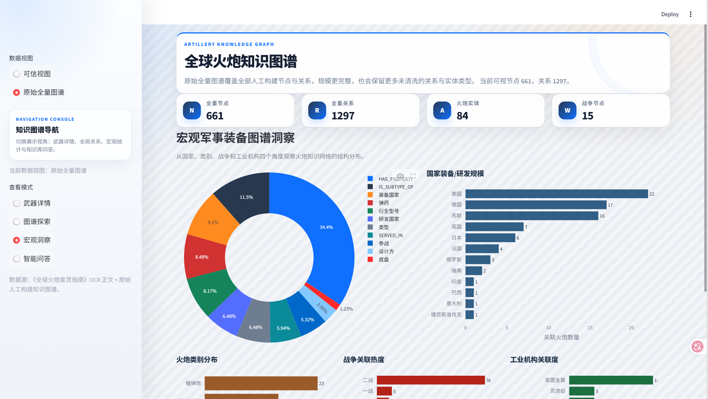
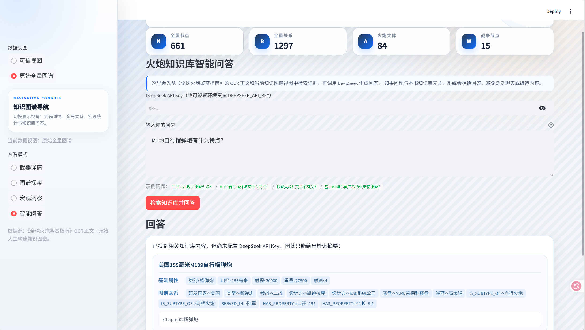

# 全球火炮知识图谱

本项目基于《全球火炮鉴赏指南》PDF 构建多模态知识图谱，覆盖目录结构化抽取、OCR 文本与图片抽取、深度关系抽取、Neo4j 导入、可视化应用与评估。

## 目录说明

- `src/step1_toc_regex_extract.py`：目录正则抽取
- `src/step2_ocr_image_extract.py`：OCR 与图片抽取
- `src/step3_deep_extract.py`：规则/LLM 混合深度抽取
- `src/step4_neo4j_import.py`：导入 Neo4j
- `src/step5_evaluation.py`：评估 Precision / Recall / F1
- `src/build_project_summary.py`：生成实验报告
- `app.py`：Streamlit 可视化应用

## 安装依赖

```powershell
pip install -r .\requirements.txt
```

## 推荐执行顺序

```powershell
cd .\src
python .\step1_toc_regex_extract.py
python .\step2_ocr_image_extract.py
python .\step3_deep_extract.py
python .\step5_evaluation.py
python .\build_project_summary.py
```

如需导入 Neo4j：

```powershell
python .\step4_neo4j_import.py
```

## 启动应用

```powershell
streamlit run .\app.py
```

## 当前结果

- 原始实体总数：673
- 原始关系总数：1314
- 去重后节点总数：662
- 去重后关系总数：1314
- 评估基准实体数：274
- 评估基准关系数：576
- 应用可信视图节点数：274
- 应用可信视图关系数：576

已经满足实验要求中“500+概念、1000+关系、200+概念/400+关系评估、构建图谱应用”的主体要求。

## 页面展示：





